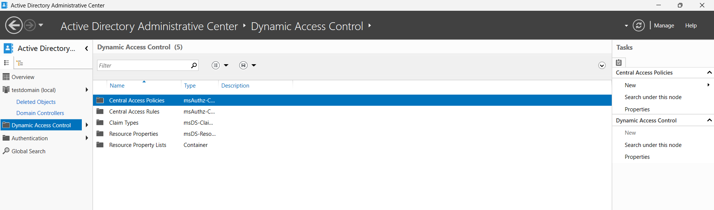
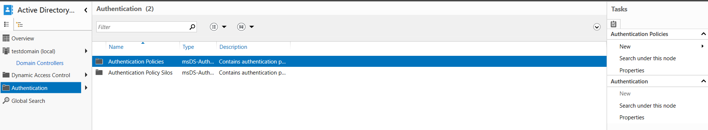

# 🧭 Step-by-Step Guide to Active Directory Administrative Center (ADAC)

## 📘 1. Introduction to Active Directory Administrative Center (ADAC)

The **Active Directory Administrative Center (ADAC)** is a powerful, though often underutilized, management console in Windows Server. It provides a modern interface for managing **Active Directory (AD)** objects and enables advanced features such as:

- Creating and managing **users, groups, and OU's**
- Implementing **Dynamic Access Control (DAC)**
- Defining **Authentication Policies**
- Managing the **AD Recycle Bin** for object recovery

Let’s dive into each of these capabilities.

---

## 🧑‍💼 2. Launching ADAC

To access ADAC:

1. Click **Start**.
2. Search for **“Active Directory Administrative Center”** and open it.

Alternatively:

- Open **Server Manager**
- Go to **Tools > Active Directory Administrative Center**

Active Directory Administrative Center Overview.

---

## 🧰 3. Managing AD Objects

Once inside ADAC:

- Select your domain name from the left panel (e.g., `testdomain.com`) whic is the doamin we configured previously.
- You can now perform CRUD operations:

  - **Create User**: Right-click the domain > New > User
  - **Delete User**: Locate the user > right-click > Delete
  - **Modify Groups**, **Manage OUs**, and more…

  

ADAC simplifies these common administrative tasks with a clean interface and contextual actions.

---

## 🔐 4. Dynamic Access Control (DAC)

**Dynamic Access Control** is used to enforce access policies based on user and resource attributes.

In ADAC:

1. Navigate to **“Claim Types”** and **“Resource Properties”**
2. Define custom **user claims** (e.g., Department, Location)
3. Apply access policies based on these claims using Group Policy

> This allows for centralized and flexible access management across your domain.

---

## 🛡 5. Authentication Policies

Authentication policies control how and when users authenticate, especially in high-security environments.

To create an Authentication Policy:

1. In ADAC, click on your domain
2. Select **“Authentication”** on the left panel
3. Choose **“New” > “Authentication Policy”**
4. Configure:
   - User assignments
   - Authentication methods
   - Access times and locations

> These policies work in tandem with DAC to secure sensitive resources.

---

## 🗑️ 6. Enabling the Recycle Bin

By default, the **Active Directory Recycle Bin** is disabled. To enable it:

1. In ADAC, click your domain
2. On the right pane, click **“Enable Recycle Bin”**
3. Click **OK** to accept the prompt

> ⚠️ Enabling the Recycle Bin is irreversible. Once enabled, it cannot be turned off.

You'll see a message indicating the Recycle Bin is being enabled. Once done:

- **Refresh ADAC**
- You will now see a new folder named **“Deleted Objects”**

---

## 🧪 7. Testing Recycle Bin Functionality

Let’s create and delete a test Organizational Unit (OU), then recover it.

### 📍 Create Test OU

1. Open **Active Directory Users and Computers (ADUC)**

2. Right-click your domain > **New > Organizational Unit**

3. Name it: `TestOU`

4. Verify the OU appears in your domain tree

### 🗑️ Delete the OU

1. Right-click `TestOU` > Click **Delete**

2. Confirm the deletion

### 🔄 Restore from Recycle Bin

1. Go back to **ADAC**
2. Navigate to **“Deleted Objects”**

3. Select `TestOU`
4. On the right panel, click **Restore**

✅ You’ll now find `TestOU` back in **ADUC**, fully restored with its original properties.

---

## 📌 Conclusion

The **Active Directory Administrative Center** is a robust console that elevates your AD management capabilities. It’s ideal for:

- Performing administrative operations with ease
- Defining access based on dynamic attributes
- Enforcing secure authentication workflows
- Recovering mistakenly deleted objects without relying solely on backups

Don’t overlook ADAC — it’s a valuable asset for every modern Windows Server administrator.

## Best Practices

- **Regularly back up AD** even with the Recycle Bin enabled.
- Use **Dynamic Access Control** for flexible, attribute-based security.
- Regularly review **authentication policies** for security and compliance.