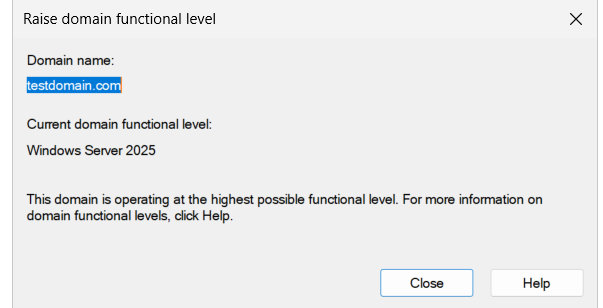

# 🌐 Step-by-Step Guide: Active Directory Domains and Trusts

## 🧭 Introduction

The **Active Directory Domains and Trusts** console in Windows Server is a powerful utility that provides administrators with tools to:

- View and raise **domain and forest functional levels**
- Establish **trust relationships** between different domains and forests

Functional levels define the available features in Active Directory, and trust relationships enable users in one domain to access resources in another securely.

---

## ⚙️ Prerequisites

Before proceeding:

1. You must be logged in as a **Domain Admin** or equivalent.
2. Your domain should be in a healthy state with **replication functioning properly**.
3. You need **DNS configured correctly** between domains if creating external trusts.

---

## 🏁 Step 1: Open Active Directory Domains and Trusts

1. Click **Start** and type `domain.msc` or:
2. Open **Server Manager > Tools > Active Directory Domains and Trusts**.
3. The console launches, showing your domain on the left panel.

---

## 📈 Step 2: View or Raise Domain Functional Level

Functional levels determine the AD features available in your environment.

To view the current level:

1. Right-click your domain in the left pane (e.g., `testdomain.com`).
2. Select **“Raise Domain Functional Level…”**

3. A dialog box will show the current functional level. For this example, it is **Windows Server 2025**.

To raise the level:

4. From the drop-down, select the next higher functional level (if available).
5. Click **Raise** to apply the change.

> ⚠️ Raising the functional level is irreversible. Ensure all domain controllers support the new level.

---

## 🌳 Step 3: View or Raise Forest Functional Level

1. In the same console, right-click **Active Directory Domains and Trusts (root node)**.
2. Select **“Raise Forest Functional Level…”**
3. A dialog appears showing your current forest functional level.
4. Select a higher level from the list (if available), then click **Raise**.

> Your forest functional level controls cross-domain and cross-forest feature capabilities.

---

## 🔐 Step 4: Creating Trust Relationships

Trusts allow identity federation between domains or forests.

To create a trust:

1. In the console, right-click your domain > **Properties**
2. Navigate to the **Trusts** tab
3. Click **New Trust...** to launch the Trust Wizard

### Follow the Wizard Steps:

1. **Specify the name** of the other domain (e.g., `remote.example.net`)
2. Choose the **trust type**:
   - **External Trust**: Between unrelated domains
   - **Forest Trust**: Between forests (both must be at forest functional level)
3. Choose **Trust Direction**:
   - **Two-way** (full trust)
   - **One-way incoming/outgoing**
4. Provide **authentication credentials**
5. Confirm the trust setup

After creation:

- Validate the trust by clicking **Validate** under the Trusts tab.
- Test authentication by logging in from a trusted domain.

---

## 📝 Notes and Best Practices

- Always ensure **DNS resolution** works between trusting domains.
- Raising functional levels **unlocks new AD features** (e.g., Fine-Grained Password Policies, Authentication Mechanism Assurance).
- Use **Forest Trusts** when consolidating or collaborating across organizations.
- Maintain **backups and change logs** before raising functional levels or modifying trust relationships.

---

## ✅ Summary

Active Directory Domains and Trusts empower administrators to:

- Elevate the AD feature set via **functional levels**
- Connect and collaborate across **trusted domains and forests**
- Maintain secure, federated environments in complex networks

A foundational tool in enterprise identity management, mastering this console is key to scalable and secure Windows Server environments.
